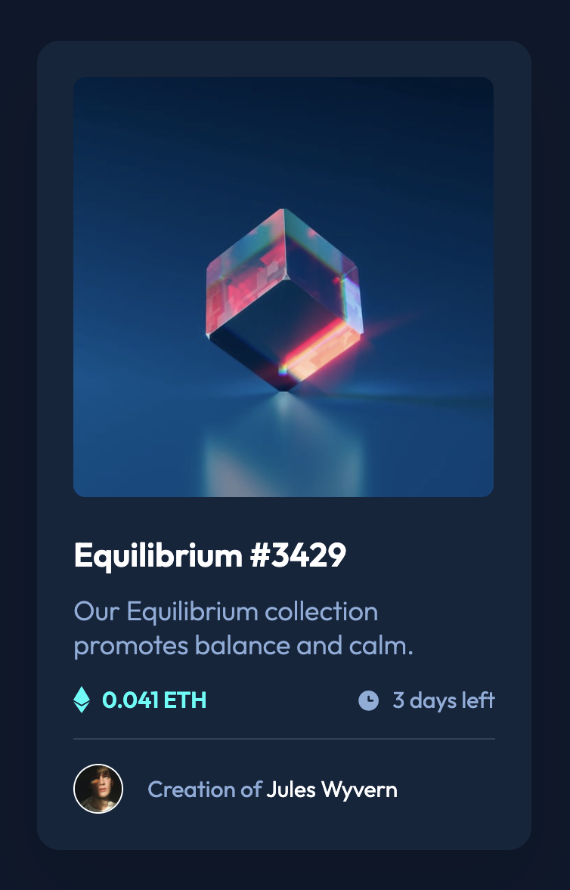

# NFT preview card component solution

This is a solution to the [NFT preview card component challenge on Frontend Mentor](https://www.frontendmentor.io/challenges/nft-preview-card-component-SbdUL_w0U).

## Table of contents

- [Overview](#overview)
  - [The challenge](#the-challenge)
  - [Screenshot](#screenshot)
  - [Links](#links)
- [My process](#my-process)
  - [Built with](#built-with)
  - [What I learned](#what-i-learned)
  - [Continued development](#continued-development)
- [Author](#author)

## Overview

### The challenge

Users should be able to:

- View the optimal layout depending on their device's screen size
- See hover states for interactive elements

### Screenshot

### Links

- [Solution on frontendmentor.io]()
- [Live preview]()

## My process

### Built with

- Semantic HTML5 markup
- CSS custom properties
- Flexbox
- Mobile-first workflow
- Pseudo-classes

### What I learned

In this project I learned that even though I start with mobile-first approach then Galaxy Fold beats up other smartphones width size with his 280px. I want to work on as good accessibility as possible so it wouldn't be smart to overlook it. 

### Continued development

I want to improve user accessibility as much as possible. Unfortunately I don't own as many devices to check everything, so I must rely on built-in tools, but I do my best to make it look at least good.

## Author

- Github - [@PiwkoO](https://github.com/PiwkoO)
- Frontend Mentor - [@PiwkoO](https://www.frontendmentor.io/profile/PiwkoO)